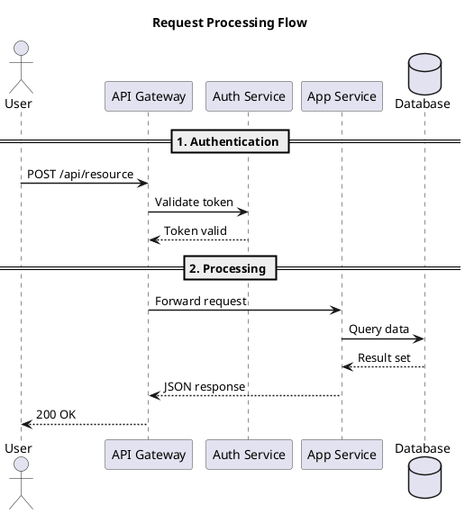

# Diagrams with PlantUML

Use PlantUML for architecture diagrams following the C4 model (Context, Container, Component,
Code). This gives you version-controlled, diffable diagram source instead of opaque image files.

## Directory Layout

```
docs/diagrams/
├── src/              # .puml source files (version-controlled)
├── out/              # Rendered .svg output (version-controlled)
└── vendor/
    └── C4-PlantUML/  # Vendored C4 library (git submodule or copy)
```

## C4 Context Diagram Example (C1)

```plantuml
@startuml c1-system-context
!pragma layout smetana
!define RELATIVE_INCLUDE ""
!include ../vendor/C4-PlantUML/C4_Context.puml

title System Name — System Context (C1)

Person(user, "End User", "Interacts with the system")

System(app, "Application", "Core system description")

System_Ext(ext_api, "External API", "Third-party service")
System_Ext(db, "Database", "PostgreSQL / MySQL")

Rel(user, app, "Uses")
Rel(app, ext_api, "Calls API")
Rel(app, db, "Reads/writes data")

@enduml
```

## Sequence Diagram Example



## C4 Diagram Levels

| Level | File Prefix | Include | Purpose |
|-------|-------------|---------|---------|
| C1 — Context | `c1-` | `C4_Context.puml` | System boundaries and external actors |
| C2 — Container | `c2-` | `C4_Container.puml` | Applications, databases, services within the system |
| C3 — Component | `c3-` | `C4_Component.puml` | Internal components within a container |
| Sequence | `seq-` | (none) | Request/data flows between participants |

## Rendering `.puml` to `.svg`

```bash
# Single file
plantuml -tsvg docs/diagrams/src/c1-system-context.puml -o ../out/

# All diagrams
plantuml -tsvg docs/diagrams/src/*.puml -o ../out/
```

- Use `!pragma layout smetana` for the built-in layout engine (no Graphviz dependency)
- Always render to SVG — scales cleanly and supports dark mode
- Vendor the C4-PlantUML library locally (don't use remote `!include` URLs)
- Name files to match the diagram level: `c1-`, `c2-`, `c3-`, `seq-`

## Referencing in Markdown

```markdown

```

## Adding to the Makefile

```makefile
diagrams: ## Render all PlantUML diagrams to SVG
	plantuml -tsvg docs/diagrams/src/*.puml -o ../out/
```

## Sources

- [PlantUML](https://plantuml.com/)
- [C4-PlantUML](https://github.com/plantuml-stdlib/C4-PlantUML)
- [C4 Model](https://c4model.com/)
